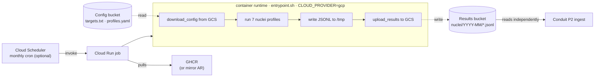

# GCP Cloud Deploy — Architecture

How the cloud-automated tier of the `leansecurity-nuclei` pipeline runs on GCP, and why the pieces are arranged the way they are. The pipeline runs in three modes — Local CLI, Local Docker, Cloud (GCP) — sharing the same scanner core. This document describes the third tier.

## 1. Context and intent

The pipeline runs Nuclei against external client assets on a monthly cadence, writes JSONL into client-controlled cloud storage, and exits. The container is ephemeral; the schedule is in GCP; the operator is the architect. `leansecurity-nuclei` itself is published as an open-source pipeline. Per-client deployment configuration is *not* in this repository.

## 2. Operating model — open-source pipeline, client-hosted deployments

### Public repo, private deployments

This repository is public. It contains the reusable scanning pipeline: scanner, container image build, Terraform module, documentation. It contains **zero client-identifying data**.

Per-client deployment configuration — Terraform `tfvars`, target lists, backend configuration — lives entirely outside this repository, in client-controlled storage. There is no `deployments/<client>/` folder in this repo. [`deployments/_example/`](../deployments/_example/) exists only as a template documenting what a private deployment folder should contain.

This is the standard shape for an open-source consulting product: the public repo publishes the module; consumers reference it from private workspaces. Terraform's own ecosystem works exactly this way (`terraform-aws-modules`, `cdk-patterns`, etc.).

### The operator is the architect, not CI

LeanSecurity GitHub Actions does not run `terraform apply` against any client project. The architect runs Terraform from a local workstation, authenticated as themselves via `gcloud auth application-default login`, with per-engagement scoping. The repo's CI runs lint, test, and image publishing — nothing else touches GCP.

Once provisioned, each client's scanner runs autonomously inside the client's GCP project on a Cloud Scheduler cadence. The architect's involvement ends with `terraform apply`. GCP itself closes the operational loop.

### Scanner image distribution via GHCR

The scanner Docker image is built by the public repo's CI and published to GitHub Container Registry at `ghcr.io/leansecurity/nuclei-scanner:<tag>`. This is the open-source artifact. Cloud Run jobs in client projects pull from GHCR directly, or optionally mirror into the client's own Artifact Registry first (a per-deployment choice gated by [`enable_ar_mirror`](../infra/gcp/README.md#enable_ar_mirror-default-false)).

### Trust topology

```mermaid
flowchart TD
  subgraph Public["Public open-source repo"]
    CI["GitHub Actions CI<br/>(lint, test, build image)"]
    Module["Terraform module<br/>(infra/gcp/)"]
  end

  GHCR["GHCR<br/>ghcr.io/leansecurity/nuclei-scanner<br/>(public, semver tagged)"]
  Arch["Architect workstation<br/>terraform apply<br/>(gcloud auth as architect)"]

  subgraph Private["Client-controlled storage"]
    Cfg["tfvars · targets · backend.tf"]
  end

  subgraph Client["Client GCP project"]
    Run["Cloud Run job"]
    Sched["Cloud Scheduler (optional)"]
    Buckets["Config + Results buckets"]
    WIF["WIF pool (optional)"]
  end

  CI -- publish --> GHCR
  Module -. source = git::... .-> Arch
  Cfg --> Arch
  Arch -- applies --> Client
  GHCR -- image pull at scan time --> Run
  Sched -- triggers --> Run
  Run --> Buckets

  classDef note fill:#fffbe6,stroke:#999,color:#333;
```

No LeanSecurity-owned GCP infrastructure. No per-client artifacts in the public repo.

### What lives where

| Artifact | Location | Owner |
|---|---|---|
| Scanner code, Terraform module, Dockerfile, `_example/` | Public repo | LeanSecurity |
| Scanner image | GHCR (public) | LeanSecurity |
| Per-client tfvars, targets.txt, backend.tf | Client-controlled private storage | Client / shared with architect |
| Per-client Terraform state | GCS bucket in client GCP project | Client |
| Per-client GCP resources (buckets, Cloud Run, Scheduler, IAM) | Client GCP project | Client |

## 3. Runtime scan execution flow

Once provisioned, a scan run is fully autonomous if Cloud Scheduler is enabled. The scheduler fires monthly, the Cloud Run job spins up an ephemeral container pulled from GHCR (or the client's mirrored Artifact Registry), the container reads its config from GCS, runs all 7 Nuclei profiles, writes JSONL to GCS, and exits.



### Three properties to note

- **Ephemeral.** No persistent compute. The container exists only while the scan runs, then exits. The Cloud Run job definition persists; the running instance does not. This is what "no persistent infrastructure in cloud mode" means concretely.
- **Loose coupling to Conduit.** The scanner does not know Conduit exists. It writes JSONL to a GCS prefix; Conduit's P2 ingest adapter reads from that prefix on its own schedule. The bucket is the contract.
- **Directory structure parity.** `<results-bucket>/nuclei/YYYY-MM/<profile>_YYYY-MM.jsonl` in cloud mode mirrors `results/<client>/YYYY-MM/<profile>_YYYY-MM.jsonl` in local mode. This is what makes `gcloud storage cp` the trivial bridge between local and cloud — no transformation required.

## 4. Module flags — what's optional

The Terraform module exposes three flags that adapt the deployment to engagement model. Full reference: [`infra/gcp/README.md`](../infra/gcp/README.md).

| Flag | Default | Effect when enabled | When to use the non-default |
|---|---|---|---|
| `enable_scheduler` | `true` | Provisions Cloud Scheduler job + scheduler SA + invoker IAM binding. Monthly cron fires the Cloud Run job autonomously. | Disable if the client drives scan cadence from their own scheduling system (Airflow, internal CI, manual on-demand). |
| `enable_wif` | `false` | Provisions Workload Identity Federation pool, GitHub OIDC provider, and SA binding. Allows an external CI to authenticate as a GCP service account without static keys. | Enable if the client wants to drive scans from their own CI, or if a future engagement model requires CI-driven Terraform apply. |
| `enable_ar_mirror` | `false` | Provisions a `google_artifact_registry_repository` in the client project for mirroring the GHCR image. The mirror push is performed manually by the architect after apply. | Enable for clients whose policies require in-project container registry locality. |

The asymmetric defaults reflect what's intrinsic to the pipeline. Autonomous monthly cadence is the product; CI-driven access and registry mirroring are power-user extensions.

### What WIF provides, briefly

Workload Identity Federation lets external systems (GitHub Actions, AWS, on-prem) authenticate as a GCP service account using short-lived OIDC tokens instead of long-lived JSON key files. The trust binding lives in GCP; no static credentials exist anywhere. It's the modern replacement for service account keys.

In the default operating model, WIF is unnecessary — the architect runs Terraform from a workstation with personal gcloud credentials, and the image build pushes to GHCR with the workflow's built-in `GITHUB_TOKEN`. WIF earns its place only when an external system needs persistent authenticated access to the client project, which is not part of the default activation.

## 5. Public repo CI/CD model

The public repo has exactly two CI workflows. Both run in GitHub Actions, both touch only the public repo's own resources, neither has GCP credentials.

| Workflow | Trigger | Action | Auth |
|---|---|---|---|
| [`ci.yaml`](../.github/workflows/ci.yaml) | Every push and PR | Lint (Black, Ruff), security scan (Bandit), pytest | None |
| [`publish-image.yaml`](../.github/workflows/publish-image.yaml) | Push to `main` touching `docker/` or `scanner/`, and on Git tag `v*` | Build container image, push to GHCR with `:latest`, `:<sha>`, and (on tag) `:vX.Y.Z` | `GITHUB_TOKEN` (built-in) |

There is **no client-deploy CI in the public repo**. The "gated workflow" pattern from earlier scaffolding is obsolete under this model — there is no per-client Terraform apply for CI to run.

### GHCR image tagging

Images are tagged with three labels per build:

- `ghcr.io/leansecurity/nuclei-scanner:latest` — moves with every main-branch build. For experimentation only.
- `ghcr.io/leansecurity/nuclei-scanner:<short-sha>` — immutable, traceable to source. For pinned deployments.
- `ghcr.io/leansecurity/nuclei-scanner:vX.Y.Z` — semantic version, set on Git tag push. The recommended pin for production deployments.

Client `tfvars` should pin to a semver or SHA tag, never `:latest`. The pin is the deliberate decision point for scanner version rollout per client.

For the maintainer-side procedure (one-time GHCR setup, cutting a semver release, verifying a publish, rolling back), see [`release.md`](release.md).

## 6. Per-client onboarding

Onboarding a new client is a procedure run by the architect. It is mechanical, scriptable, and billable to the engagement.

| # | Step | Where | Tool |
|---|------|-------|------|
| 1 | Identify or create client GCP project | Client | gcloud / GCP console |
| 2 | Enable required APIs in the client project | Client project | gcloud |
| 3 | Create Terraform state bucket | Client project | [`scripts/bootstrap-gcp-client.sh`](../scripts/bootstrap-gcp-client.sh) |
| 4 | Grant architect IAM access to the client project | Client project | gcloud (by client admin) |
| 5 | Provision private storage for the deployment folder | Per engagement | Client-controlled (private git repo, encrypted shared drive, GCS bucket, etc.) |
| 6 | Copy `deployments/_example/` into the private storage | Architect workstation | git / filesystem |
| 7 | Populate `terraform.tfvars`, `backend.tf`, `targets.txt` | Architect workstation | editor |
| 8 | `terraform init` against the client state bucket | Architect workstation | terraform |
| 9 | `terraform plan`, review | Architect workstation | terraform |
| 10 | `terraform apply` | Architect workstation | terraform |
| 11 | Manually trigger first scan, verify JSONL output | Client project | gcloud |
| 12 | Confirm Cloud Scheduler shows correct next execution time | Client project | gcloud / GCP console |

Steps 1–4 are bootstrap: they create the trust anchor that lets Terraform run. They are codified in [`scripts/bootstrap-gcp-client.sh`](../scripts/bootstrap-gcp-client.sh) — not in Terraform, because Terraform itself depends on the state bucket and architect IAM access existing first.

Steps 5–7 use the engagement-specific private storage. The architect maintains a local working copy of each client's deployment folder, with the source of truth being whatever private location the engagement designates (per-client variant). When the architect needs to update a client's config — change targets, bump scanner image version — they pull, edit, apply, push back.

### Required APIs (step 2)

The bootstrap script enables the full set. Trim manually if a flag is disabled:

- `run.googleapis.com` — Cloud Run Admin API
- `cloudscheduler.googleapis.com` — only if `enable_scheduler = true`
- `storage.googleapis.com` — Cloud Storage API
- `iam.googleapis.com` — IAM API
- `iamcredentials.googleapis.com` — required for WIF (only if `enable_wif = true`)
- `sts.googleapis.com` — Security Token Service (only if `enable_wif = true`)
- `artifactregistry.googleapis.com` — only if the deployment mirrors the GHCR image (`enable_ar_mirror = true`)

### IAM for the architect (step 4)

Granted at the project level by the client admin, scoped to the engagement:

- `roles/run.admin`
- `roles/cloudscheduler.admin` (only if `enable_scheduler = true`)
- `roles/storage.admin`
- `roles/iam.serviceAccountAdmin`
- `roles/iam.serviceAccountUser`
- `roles/iam.workloadIdentityPoolAdmin` (only if `enable_wif = true`)
- `roles/artifactregistry.admin` (only if `enable_ar_mirror = true`)

### Time estimate

A clean onboarding, with the bootstrap script in hand and a GCP project ready, is approximately **30–60 minutes of architect time** — most of it waiting for GCP API enablement and the first `terraform apply`. One-time per client.

## See also

- [Root README](../README.md) — modes, quick starts, repo layout.
- [Module reference](../infra/gcp/README.md) — variable + output tables, flag semantics.
- [Setup guide](setup-guide.md) — step-by-step walkthrough with verification snippets and troubleshooting.
- [`deployments/_example/`](../deployments/_example/) — template for the private deployment folder.
- [`scripts/bootstrap-gcp-client.sh`](../scripts/bootstrap-gcp-client.sh) — one-shot project preparation.
