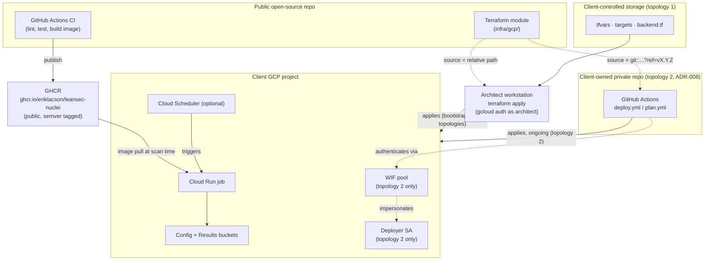
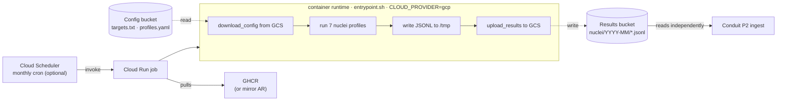

# GCP Cloud Deploy — Architecture

How the cloud-automated tier of the `leansecurity-nuclei` pipeline runs on GCP, and why the pieces are arranged the way they are. The pipeline runs in three modes — Local CLI, Local Docker, Cloud (GCP) — sharing the same scanner core. This document describes the third tier.

## 1. Context and intent

The pipeline runs Nuclei against external client assets on a monthly cadence, writes JSONL into client-controlled cloud storage, and exits. The container is ephemeral; the schedule is in GCP. `leansecurity-nuclei` itself is published as an open-source pipeline. Per-client deployment configuration is *not* in this repository.

Two deployment topologies share the same Terraform module (`infra/gcp/`): the architect runs `terraform apply` from a local workstation against a deployment folder in this repo checkout (the default), or the client owns a private repo whose own CI applies the same module under Workload Identity Federation ([ADR-008](../decisions/ADR-008-per-client-repo-topology.md)). §2 describes both.

## 2. Operating model — open-source pipeline, client-hosted deployments

### Public repo, private deployments

This repository is public. It contains the reusable scanning pipeline: scanner, container image build, Terraform module, documentation. It contains **zero client-identifying data**.

Per-client deployment configuration — Terraform `tfvars`, target lists, backend configuration — lives either in `deployments/<client>/` inside this repo checkout (gitignored, architect-run topology) or in a private repo the client owns (client-owned CI topology, ADR-008). No client-identifying files are ever committed to this repo under either topology. [`infra/gcp/_example/`](../infra/gcp/_example/) is the template for the former; [`infra/gcp/client-repo-template/`](../infra/gcp/client-repo-template/) is the template for the latter.

This is the standard shape for an open-source consulting product: the public repo publishes the module; consumers reference it from private workspaces. Terraform's own ecosystem works exactly this way (`terraform-aws-modules`, `cdk-patterns`, etc.).

### Skill-assisted deployment

The [`gcp-deploy` Claude Code skill](../.claude/skills/gcp-deploy/README.md) is an
automation layer over this operating model. It reads a high-level `deployment.yaml`,
validates it, renders the Terraform inputs described in this document, and orchestrates
`terraform init`, `plan`, and `apply` with operator confirmation in chat. The skill
invokes the same `infra/gcp/` module described here — it does not bypass or replace it.
The architecture is unchanged; the skill is purely a *how*, not a *what*. It also performs the architect's one-time bootstrap apply in the client-owned topology below — it is not exclusive to the architect-run topology.

### Two topologies: who runs `terraform apply`

**Topology 1 — architect-run (default).** LeanSecurity GitHub Actions does not run `terraform apply` against any client project. The architect runs Terraform from a local workstation, authenticated as themselves via `gcloud auth application-default login`, with per-engagement scoping. The repo's CI runs lint, test, and image publishing — nothing else touches GCP. Once provisioned, each client's scanner runs autonomously inside the client's GCP project on a Cloud Scheduler cadence; the architect's involvement ends with `terraform apply`. GCP itself closes the operational loop for scan execution.

**Topology 2 — client-owned CI ([ADR-008](../decisions/ADR-008-per-client-repo-topology.md)).** The architect runs a one-time local bootstrap apply — same mechanism as topology 1, with `enable_wif: true` and `wif_github_repository` set — that provisions a dedicated deployer service account and a WIF trust binding scoped to a private repo the client owns. The client then copies [`infra/gcp/client-repo-template/`](../infra/gcp/client-repo-template/) into that repo. From that point, the client's own GitHub Actions (`deploy.yml`, `plan.yml`) run `terraform apply`/`plan` on every push/PR to *their* repo, authenticated via WIF — no long-lived key stored anywhere. This repo's own CI is still never involved; the client-owned repo is a **second** Terraform root writing to the same remote state the bootstrap apply created. See [ADR-008](../decisions/ADR-008-per-client-repo-topology.md) for the rationale and [`infra/gcp/client-repo-template/README.md`](../infra/gcp/client-repo-template/README.md) for the exact handoff sequence.

Both topologies provision identical client-side infrastructure (Cloud Run job, Scheduler, buckets) from the same module — they differ only in who applies changes after the initial bootstrap.

### Scanner image distribution via GHCR

The scanner Docker image is built by the public repo's CI and published to GitHub Container Registry at `ghcr.io/eriklacson/leansec-nuclei:<tag>`. This is the open-source artifact. Cloud Run jobs in client projects pull from GHCR directly, or optionally mirror into the client's own Artifact Registry first (a per-deployment choice gated by [`enable_ar_mirror`](../infra/gcp/README.md#enable_ar_mirror-default-false)).

### Trust topology

No LeanSecurity-owned GCP infrastructure. No per-client artifacts in the public repo — `client-repo-template/` is a template, not a per-client copy.

### What lives where

| Artifact | Location | Owner |
|---|---|---|
| Scanner code, Terraform module, Dockerfile, `_example/` | Public repo | LeanSecurity |
| Scanner image | GHCR (public) | LeanSecurity |
| Per-client tfvars, targets.txt, backend.tf (topology 1) | `deployments/<client>/` in repo checkout (gitignored) | Client / shared with architect |
| Client-owned deployment repo, copied from `infra/gcp/client-repo-template/` (topology 2) | Client's own private GitHub repo | Client |
| Per-client Terraform state | GCS bucket in client GCP project | Client |
| Per-client GCP resources (buckets, Cloud Run, Scheduler, IAM) | Client GCP project | Client |

## 3. Runtime scan execution flow

Once provisioned, a scan run is fully autonomous if Cloud Scheduler is enabled. The scheduler fires monthly, the Cloud Run job spins up an ephemeral container pulled from GHCR (or the client's mirrored Artifact Registry), the container reads its config from GCS, runs all 7 Nuclei profiles, writes JSONL to GCS, and exits.

### Three properties to note

- **Ephemeral.** No persistent compute. The container exists only while the scan runs, then exits. The Cloud Run job definition persists; the running instance does not. This is what "no persistent infrastructure in cloud mode" means concretely.
- **Loose coupling to Conduit.** The scanner does not know Conduit exists. It writes JSONL to a GCS prefix; Conduit's P2 ingest adapter reads from that prefix on its own schedule. The bucket is the contract.
- **Directory structure parity.** `<results-bucket>/nuclei/YYYY-MM/<profile>_YYYY-MM.jsonl` in cloud mode mirrors `results/<client>/YYYY-MM/<profile>_YYYY-MM.jsonl` in local mode. This is what makes `gcloud storage cp` the trivial bridge between local and cloud — no transformation required.

## 4. Module flags — what's optional

The Terraform module exposes three flags that adapt the deployment to engagement model. Full reference: [`infra/gcp/README.md`](../infra/gcp/README.md).

| Flag | Default | Effect when enabled | When to use the non-default |
|---|---|---|---|
| `enable_scheduler` | `true` | Provisions Cloud Scheduler job + scheduler SA + invoker IAM binding. Monthly cron fires the Cloud Run job autonomously. | Disable if the client drives scan cadence from their own scheduling system (Airflow, internal CI, manual on-demand). |
| `enable_wif` | `false` | Provisions a dedicated deployer service account, Workload Identity Federation pool, GitHub OIDC provider, and the trust binding between them. This is topology 2's provisioning switch ([ADR-008](../decisions/ADR-008-per-client-repo-topology.md)) — not a hypothetical future option. | Enable for the client-owned CI topology — the client's own GitHub Actions apply Terraform under this identity. See [`infra/gcp/client-repo-template/`](../infra/gcp/client-repo-template/). |
| `enable_ar_mirror` | `false` | Provisions a `google_artifact_registry_repository` in the client project for mirroring the GHCR image. The mirror push is performed manually by the architect after apply. | Enable for clients whose policies require in-project container registry locality. |

The asymmetric defaults reflect what's intrinsic to the pipeline. Autonomous monthly cadence is the product; CI-driven access and registry mirroring are power-user extensions.

### What WIF provides, briefly

Workload Identity Federation lets external systems (GitHub Actions, AWS, on-prem) authenticate as a GCP service account using short-lived OIDC tokens instead of long-lived JSON key files. The trust binding lives in GCP; no static credentials exist anywhere. It's the modern replacement for service account keys.

In topology 1, WIF is unnecessary — the architect runs Terraform from a workstation with personal gcloud credentials, and the image build pushes to GHCR with the workflow's built-in `GITHUB_TOKEN`. WIF earns its place in topology 2, where the client's own GitHub Actions need persistent authenticated access to the client project between architect visits.

## 5. Public repo CI/CD model

The public repo has exactly two CI workflows. Both run in GitHub Actions, both touch only the public repo's own resources, neither has GCP credentials.

| Workflow | Trigger | Action | Auth |
|---|---|---|---|
| [`ci.yaml`](../.github/workflows/ci.yaml) | Every push and PR | Lint (Black, Ruff), security scan (Bandit), pytest | None |
| [`publish-image.yaml`](../.github/workflows/publish-image.yaml) | Push to `main` touching `docker/` or `scanner/`, and on Git tag `v*` | Build container image, push to GHCR with `:latest`, `:<sha>`, and (on tag) `:vX.Y.Z` | `GITHUB_TOKEN` (built-in) |

This public repo's own CI never runs `terraform apply` against a client project — that remains true under both topologies above. The "gated workflow" pattern from earlier scaffolding, which would have run per-client Terraform apply *from inside this repo's own CI*, remains obsolete; nothing in this repo's `.github/workflows/` does that.

Client-owned CI (topology 2) is a different thing entirely: `infra/gcp/client-repo-template/` publishes a `deploy.yml`/`plan.yml` pair that *does* run per-client `terraform apply`/`plan` — but only once copied into the client's own private repo, running as the client's own CI, under WIF. That workflow pair is a template shipped by this repo, not a workflow this repo runs. See §2, topology 2.

### GHCR image tagging

Images are tagged with three labels per build:

- `ghcr.io/eriklacson/leansec-nuclei:latest` — moves with every main-branch build. For experimentation only.
- `ghcr.io/eriklacson/leansec-nuclei:<short-sha>` — immutable, traceable to source. For pinned deployments.
- `ghcr.io/eriklacson/leansec-nuclei:vX.Y.Z` — semantic version, set on Git tag push. The recommended pin for production deployments.

Client `tfvars` should pin to a semver or SHA tag, never `:latest`. The pin is the deliberate decision point for scanner version rollout per client.

For the maintainer-side procedure (one-time GHCR setup, cutting a semver release, verifying a publish, rolling back), see [`release.md`](release.md).

## 6. Per-client onboarding

Onboarding a new client is a procedure run by the architect. It is mechanical, scriptable, and billable to the engagement. This table describes **topology 1**; topology 2 shares steps 1–10 unchanged (with `enable_wif: true` and `wif_github_repository` set in step 6) and replaces steps 11–12 with a handoff to the client — see [`infra/gcp/client-repo-template/README.md`](../infra/gcp/client-repo-template/README.md#sequencing--this-order-matters) for the client-side steps that follow.

| # | Step | Where | Tool |
|---|------|-------|------|
| 1 | Identify or create client GCP project | Client | gcloud / GCP console |
| 2 | Enable required APIs in the client project | Client project | gcloud |
| 3 | Create Terraform state bucket | Client project | [`scripts/bootstrap-gcp-client.sh`](../scripts/bootstrap-gcp-client.sh) |
| 4 | Grant architect IAM access to the client project | Client project | gcloud (by client admin) |
| 5 | Create deployment folder in the repo checkout | Architect workstation | `cp -r infra/gcp/_example/ deployments/<client>/` |
| 6 | Populate `terraform.tfvars`, `backend.tf` | Architect workstation | editor |
| 7 | Populate `targets.txt`, `profiles.yaml` | Architect workstation | editor |
| 8 | `terraform init` against the client state bucket | Architect workstation | terraform |
| 9 | `terraform plan`, review | Architect workstation | terraform |
| 10 | `terraform apply` | Architect workstation | terraform |
| 11 | Manually trigger first scan, verify JSONL output (topology 1) — or hand off `terraform output` + tfvars values to the client (topology 2) | Client project | gcloud, or see client-repo-template README |
| 12 | Confirm Cloud Scheduler shows correct next execution time | Client project | gcloud / GCP console |

Steps 1–4 are bootstrap: they create the trust anchor that lets Terraform run. They are codified in [`scripts/bootstrap-gcp-client.sh`](../scripts/bootstrap-gcp-client.sh) — not in Terraform, because Terraform itself depends on the state bucket and architect IAM access existing first.

Steps 5–7 set up the client's deployment folder at `deployments/<client>/`. The folder is gitignored, so no client data is ever committed. The architect works from this folder on their local checkout; when they need to update a client's config — change targets, bump scanner image — they edit in place and re-apply. (In topology 2, this is also where the architect's one-time bootstrap apply happens — the ongoing edits after handoff happen in the client's own repo instead.)

### Required APIs (step 2)

The bootstrap script enables the full set. Trim manually if a flag is disabled:

- `run.googleapis.com` — Cloud Run Admin API
- `cloudscheduler.googleapis.com` — only if `enable_scheduler = true`
- `storage.googleapis.com` — Cloud Storage API
- `iam.googleapis.com` — IAM API
- `iamcredentials.googleapis.com` — required for WIF (only if `enable_wif = true`)
- `sts.googleapis.com` — Security Token Service (only if `enable_wif = true`)
- `artifactregistry.googleapis.com` — only if the deployment mirrors the GHCR image (`enable_ar_mirror = true`)

### IAM for the architect (step 4)

Granted at the project level by the client admin, scoped to the engagement:

- `roles/run.admin`
- `roles/cloudscheduler.admin` (only if `enable_scheduler = true`)
- `roles/storage.admin`
- `roles/iam.serviceAccountAdmin`
- `roles/iam.serviceAccountUser`
- `roles/iam.workloadIdentityPoolAdmin` (only if `enable_wif = true`)
- `roles/artifactregistry.admin` (only if `enable_ar_mirror = true`)

### IAM for the client CI identity (topology 2 only)

Unlike the architect's IAM above, this is not granted manually — Terraform provisions it during the bootstrap apply (step 10) as part of `enable_wif = true`. A dedicated deployer service account (distinct from the scanner SA that runs Nuclei) receives these project-level roles, matching what the client's `deploy.yml`/`plan.yml` need to run `terraform apply`/`plan`:

- `roles/run.admin`
- `roles/iam.serviceAccountAdmin`
- `roles/iam.serviceAccountUser`
- `roles/storage.admin`
- `roles/cloudscheduler.admin`
- `roles/iam.workloadIdentityPoolAdmin`
- `roles/artifactregistry.admin`

The WIF trust binding then lets the client's GitHub Actions impersonate this SA using short-lived OIDC tokens, scoped to the specific `wif_github_repository`. See [`infra/gcp/README.md`](../infra/gcp/README.md#enable_wif) for the full rationale, including why this is a separate SA from the scanner identity.

### Time estimate

A clean onboarding, with the bootstrap script in hand and a GCP project ready, is approximately **30–60 minutes of architect time** — most of it waiting for GCP API enablement and the first `terraform apply`. One-time per client.

## See also

- [Root README](../README.md) — modes, quick starts, repo layout.
- [Module reference](../infra/gcp/README.md) — variable + output tables, flag semantics.
- [Setup guide](setup-guide.md) — step-by-step walkthrough with verification snippets and troubleshooting.
- [`infra/gcp/_example/`](../infra/gcp/_example/) — template for the private deployment folder (topology 1).
- [ADR-008](../decisions/ADR-008-per-client-repo-topology.md) — why the client-owned repo topology exists.
- [`infra/gcp/client-repo-template/`](../infra/gcp/client-repo-template/) — template for the client-owned repo (topology 2).
- [`scripts/bootstrap-gcp-client.sh`](../scripts/bootstrap-gcp-client.sh) — one-shot project preparation.
